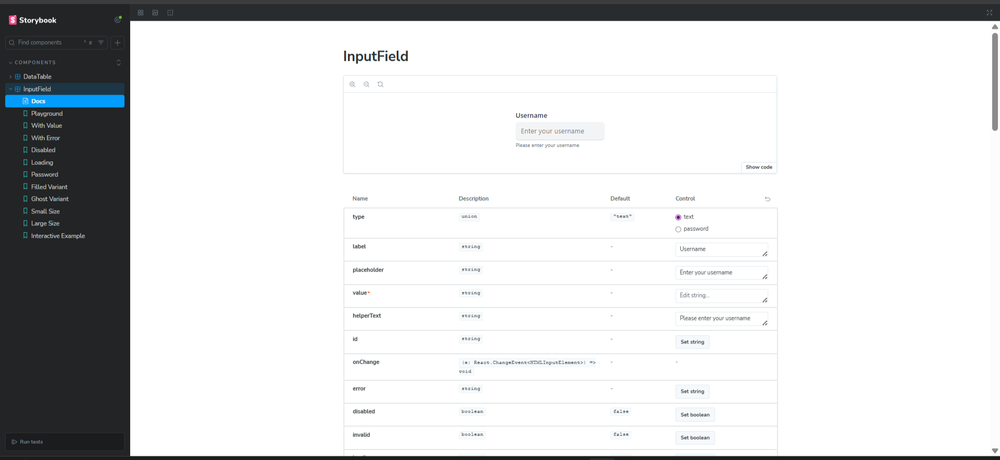
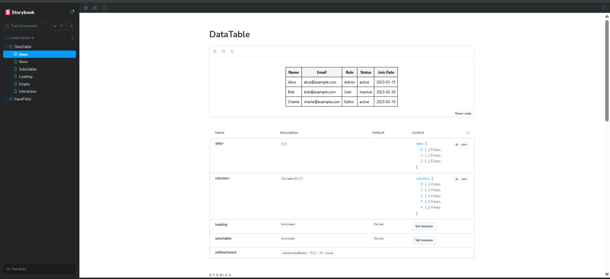

# React Component Assignment

This project is reusable React components built with **TypeScript**, **Vite**, and **TailwindCSS**.

## Features

- **InputField Component**:
  - Customizable input field with:
    - Variants: `filled`, `outlined`, `ghost`
    - Sizes: `sm`, `md`, `lg`
    - Features: Password toggle, helper text, error handling
- **DataTable Component**:
  - Dynamic table with:
    - Sorting functionality
    - Row selection
    - Empty and loading states
    - Type-safe column configuration
- **Storybook Integration**:
  - Interactive previews and documentation for all components.

## Components Overview

### InputField

A reusable input field designed for flexibility and customization.

### DataTable

A dynamic table component with support for sorting, row selection, and customizable columns.

## Screenshots

### InputField Component

### DataTable Component

## 🎥 Demo Video

### Project Showcase

### DataTable Component video-demo

[DataTable Demo Video](./src/video/DataTable-v-demo.mp4)

### InputField Component video-demo

[InputField Demo Video](./src/video/InpurField-v-demo.mp4)

## Storybook Preview

<!-- [Live Demo of project](#)   -->
_Deployed using Vercel._

---

This project demonstrates the ability to create reusable, scalable, and well-documented components.
